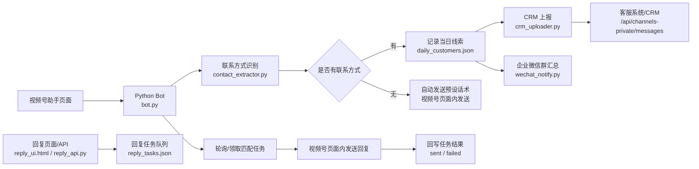
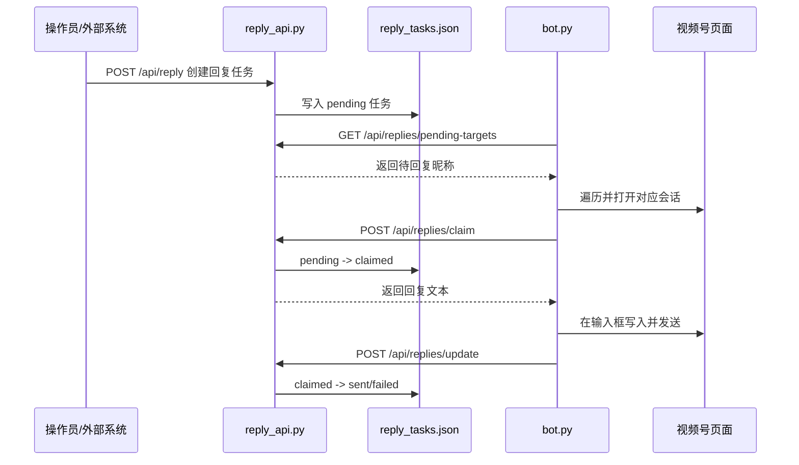

# 视频号线索上报与回复消息流程

本文档按当前项目代码整理，说明视频号 Bot 与服务器之间如何完成两类事情：

- 视频号私信里发现有效线索后，上报到客服系统/CRM。
- 服务器或本地回复页面创建回复任务后，由 Bot 回到视频号页面实际发送消息。

相关代码文件：

| 模块 | 作用 |
|------|------|
| `bot.py` | 打开视频号助手、遍历会话、识别新消息、发送回复、领取回复任务 |
| `contact_extractor.py` | 识别手机号、微信号、邮箱、QQ、姓名、产品需求 |
| `crm_uploader.py` | 组装线索内容并调用 CRM 消息上报接口 |
| `reply_api.py` | 本地回复任务服务，提供任务创建、领取、回写、线索查看 |
| `reply_ui.html` | 本地回复任务页面，可从今日线索中选择客户并创建回复任务 |
| `wechat_notify.py` | 企业微信群推送当日客户线索汇总和下线告警 |
| `config.py` | CRM、回复服务、视频号 URL、话术和运行参数配置 |

---

## 一、整体架构



---

## 二、Bot 每轮处理流程

Bot 启动后会访问 `https://channels.weixin.qq.com/platform/private_msg`，进入视频号助手私信管理页面。

循环模式下，Bot 每 8 到 12 分钟随机刷新并执行一轮处理。每轮主要做这些事：

1. 检测视频号是否仍在线。
2. 刷新视频号私信页面，加载最新会话。
3. 依次处理两个 Tab：
   - `私信`，内部标记为 `private`
   - `打招呼消息`，内部标记为 `greeting`
4. 根据配置只处理当天会话，或者处理全部会话。
5. 每个会话点击进入后，读取：
   - 客户昵称
   - 对方发来的消息 `other_messages`
   - 我方已发送的消息 `my_messages`
6. 使用消息内容 MD5 hash 与 `msg_history.json` 对比，只处理新增消息。
7. 优先检查是否有人工/接口回复任务。
8. 再根据新增消息判断是否形成线索、是否需要自动话术。
9. 如果本轮有新数据，推送当日客户线索汇总到企业微信群。

首轮扫描只建立消息历史，不做回复和上报；第二轮开始才会处理新增消息。

---

## 三、线索上报流程

### 3.1 触发条件

客户新增消息中只要检测到任意联系方式，就进入线索流程：

| 类型 | 识别规则来源 | 示例 |
|------|--------------|------|
| 手机号 | `PHONE_PATTERN` | `13800138000` |
| 微信号 | `WECHAT_PATTERN`，实际提取会结合关键词判断 | `微信号：zhangsan123` |
| 邮箱 | `EMAIL_PATTERN` | `test@example.com` |
| QQ | `QQ_PATTERN`，实际提取会结合关键词判断 | `QQ：123456789` |

Bot 会用“全部对方消息”补充提取信息，因为姓名、需求、联系方式可能分散在不同消息里。

### 3.2 Bot 生成线索对象

当前生成的 `customer_info` 结构如下：

```json
{
  "nickname": "视频号昵称",
  "name": "客户姓名",
  "contacts": {
    "phones": ["13800138000"],
    "wechats": ["zhangsan123"],
    "emails": [],
    "qqs": []
  },
  "product_needs": "产品需求/业务方向",
  "last_message": "客户最新一条消息",
  "all_messages": ["客户历史消息1", "客户历史消息2"],
  "status": "has_contact",
  "time": "2026-04-29T17:00:00"
}
```

### 3.3 本地记录与去重

线索上报前会做几层去重：

| 文件/缓存 | 作用 |
|----------|------|
| `msg_history.json` | 记录每个用户已见过的消息 hash，避免重复处理旧消息 |
| `forwarded_users.json` | 记录已经生成过线索的用户 |
| `crm_upload_preview.jsonl` | 本地预览模式下记录准备上报的 payload，用 payload hash 避免重复写入 |
| `crm_uploader.py` 内存缓存 | 同一昵称 + 相同 content hash 不重复上报 |

如果 `CRM_UPLOAD_MODE=local`，且同样的 payload 已存在于 `crm_upload_preview.jsonl`，Bot 会跳过本轮客户记录、企业微信推送和 CRM 上传。

### 3.4 上报到服务器

`crm_uploader.py` 会把 `customer_info` 转成 CRM 接口需要的 payload：

```json
{
  "nickname": "视频号昵称",
  "content": "姓名：张三\n手机号：13800138000\n产品需求：机器人方向\n全部消息记录（2条）：\n  [1] 你好\n  [2] 我是张三，电话13800138000",
  "company": "可选，公司名",
  "phone": "可选，主手机号"
}
```

实际调用接口：

```http
POST https://kefu.jq-industries.com/api/channels-private/messages
Content-Type: application/json
X-API-Key: <YOUR_API_KEY>
```

服务端成功后通常返回：

```json
{
  "success": true,
  "messageId": 12345,
  "customerId": 90001
}
```

当前配置里：

```python
CRM_UPLOAD_MODE = os.environ.get("CRM_UPLOAD_MODE", "local")
```

也就是说默认是本地预览模式，不会真正请求服务器，而是写入：

```text
crm_upload_preview.jsonl
```

要真实上报服务器，需要以 `CRM_UPLOAD_MODE=remote` 启动。

### 3.5 批量上报

代码也支持批量上报：

```http
POST /api/channels-private/messages/batch
```

请求体格式：

```json
{
  "messages": [
    {
      "nickname": "张三",
      "content": "消息内容",
      "company": "公司名",
      "phone": "13800138000"
    }
  ]
}
```

当前主流程检测到单个有效客户时调用的是 `upload_customer()`，也就是单条上报。

---

## 四、无联系方式时的自动回复流程

如果新增消息里没有手机号、微信号、邮箱或 QQ，Bot 会进入自动话术逻辑。

流程如下：

1. 判断当前会话是否已经回复过话术。
2. 判断我方历史消息里是否已经包含关键话术，如“矩侨工业”“欢迎咨询”“解决方案和对接人员”等。
3. 判断 `replied_users.json` 中是否已有记录。
4. 检查页面里是否存在红色感叹号，防止重复对发送失败的会话继续发送。
5. 如果没有回复过且未禁用自动回复，则调用 `_send_reply(AUTO_REPLY_TEXT)`。
6. 发送成功后写入 `replied_users.json`。
7. 发送失败则记录为 `reply_failed`，并写入失败记录。

当前自动话术配置在 `config.py`：

```text
您好呀！欢迎咨询[矩侨工业]为了方便为您推荐最适合的解决方案和对接人员，可以简单描述一下问题吗？我会安排人员与您联系。
1.您公司名称：

2.联系手机号/微信：

3.主要咨询业务方向（机器人/养老医疗/家具/汽车等）：

4.您的基础需求是：
```

如果启动参数带 `--no-auto-reply`，则不会发送自动话术，只会记录本地状态。

---

## 五、服务器/页面创建回复任务的流程

回复消息采用任务队列模式：



### 5.1 创建回复任务

可以通过本地页面 `reply_ui.html` 创建，也可以直接调接口。

本地服务默认地址：

```text
http://127.0.0.1:8787
```

创建任务接口：

```http
POST /api/reply
Content-Type: application/json
```

请求体：

```json
{
  "nickname": "张三",
  "conversation_id": "",
  "tab_type": "any",
  "text": "您好，已收到您的消息，我这边先为您登记。",
  "source": "manual-ui",
  "request_id": "",
  "metadata": {
    "scene": "lead-ui"
  }
}
```

字段规则：

| 字段 | 必填 | 说明 |
|------|------|------|
| `text` | 是 | 要发送给客户的回复内容 |
| `nickname` | 条件必填 | 视频号会话昵称，与 `conversation_id` 至少填一个 |
| `conversation_id` | 条件必填 | 会话 ID，与 `nickname` 至少填一个 |
| `tab_type` | 否 | `private`、`greeting` 或 `any` |
| `source` | 否 | 来源，如 `manual-ui`、`api` |
| `request_id` | 否 | 请求幂等标识 |
| `metadata` | 否 | 附加信息 |

任务会写入：

```text
reply_tasks.json
```

任务初始状态为：

```text
pending
```

### 5.2 Bot 获取待回复目标

Bot 处理某个 Tab 前会先请求：

```http
GET /api/replies/pending-targets?tab_type=private
GET /api/replies/pending-targets?tab_type=greeting
```

作用是拿到待回复的昵称列表。

即使当前配置是“只处理当天会话”，如果某个旧会话在待回复目标里，Bot 也会把它加入本轮处理范围。

### 5.3 Bot 领取任务

Bot 打开某个会话后，会用昵称领取匹配任务：

```http
POST /api/replies/claim
Content-Type: application/json
```

请求体：

```json
{
  "nickname": "张三",
  "conversation_id": "",
  "tab_type": "private",
  "claimed_by": "bot"
}
```

匹配规则：

- 任务必须是 `pending`。
- `tab_type` 必须匹配当前 Tab，或者任务本身是 `any`。
- 优先用 `conversation_id` 匹配。
- 没有 `conversation_id` 时，用 `nickname` 精确匹配。

领取成功后，任务状态变成：

```text
claimed
```

同时记录：

- `claimed_at`
- `claimed_by`
- `attempts + 1`

如果任务被领取后长时间没有结果，`reply_api.py` 会把超过 300 秒的 `claimed` 任务重新放回 `pending`。

### 5.4 Bot 实际发送回复

Bot 拿到任务的 `text` 后，会调用 `_send_reply(text)`：

1. 在视频号页面 Shadow DOM 内找到输入框。
2. 清空输入框。
3. 写入回复文本。
4. 触发 `input/change/compositionend` 事件。
5. 优先使用 Enter 键发送。
6. 发送后检查是否出现红色感叹号。

发送成功则认为任务成功。

### 5.5 回写任务状态

发送成功：

```http
POST /api/replies/update
Content-Type: application/json
```

```json
{
  "id": "任务ID",
  "status": "sent",
  "result": "sent by bot at 2026-04-29T17:00:00"
}
```

发送失败：

```json
{
  "id": "任务ID",
  "status": "failed",
  "error": "bot send reply failed"
}
```

任务状态生命周期：

```text
pending -> claimed -> sent
                   -> failed
```

失败任务可以通过更新接口重置为 `pending` 后重新执行。

---

## 六、自动回复与人工/接口回复的优先级

在每个会话里，当前处理顺序是：

1. 先领取并执行接口回复任务。
2. 再判断是否有新增客户消息。
3. 如果没有新增客户消息：
   - 已经执行过人工/接口回复，则跳过线索识别与 CRM 上传。
   - 没有人工/接口回复，也跳过本轮。
4. 如果有新增客户消息：
   - 有联系方式：记录线索并上报 CRM。
   - 无联系方式：判断是否已经回复过，没回复过才发送自动话术。

接口回复任务会让 `manual_reply_requested=True`，因此同一轮里不会再额外触发自动话术，避免重复打扰客户。

---

## 七、企业微信推送流程

当本轮产生新数据时，Bot 会调用 `send_daily_summary()` 推送当日全量客户快照到企业微信群。

推送内容包含：

| 分类 | 状态 |
|------|------|
| 已留联系方式客户 | `has_contact` |
| 未留联系方式客户 | `no_contact` |
| 打招呼客户 | `greeting` |
| 回复失败客户 | `reply_failed` |

推送不是只发新增一条，而是发“当天累计全量快照”。所以只看企业微信群最新一条，就能看到当天所有客户线索。

如果微信号下线，Bot 会执行下线流程：

1. 保存 `daily_customers.json`。
2. 推送下线告警。
3. 推送下线前全量线索存档。
4. 保存登录页截图。
5. 退出。

---

## 八、关键配置

`config.py` 中与本流程最相关的配置如下：

```python
CRM_API_URL = "https://kefu.jq-industries.com/api/channels-private/messages"
CRM_API_KEY = "<YOUR_API_KEY>"
CRM_UPLOAD_MODE = os.environ.get("CRM_UPLOAD_MODE", "local")
CRM_LOCAL_PREVIEW_FILE = "./crm_upload_preview.jsonl"

REPLY_API_HOST = "127.0.0.1"
REPLY_API_PORT = 8787
REPLY_API_PREVIEW_FILE = "./reply_api_preview.jsonl"
REPLY_API_TASKS_FILE = "./reply_tasks.json"
REPLY_API_ENABLED = True
REPLY_API_TIMEOUT = 5

RUN_CONFIG = {
    "check_interval_min": 480,
    "check_interval_max": 720,
    "max_conversations": 50,
    "private_scan_scope": "today",
    "greeting_scan_scope": "today",
}
```

注意：

- 默认 `CRM_UPLOAD_MODE=local`，线索不会真实上报服务器。
- 要真实上报 CRM，需要设置环境变量 `CRM_UPLOAD_MODE=remote`。
- 回复任务服务是本地 HTTP 服务，默认端口 `8787`。
- Bot 只有遍历到匹配会话时，才会真正把回复任务发到视频号页面。

---

## 九、常见排查点

| 问题 | 优先检查 |
|------|----------|
| 线索没有进入服务器 | 是否仍是 `CRM_UPLOAD_MODE=local`；查看 `crm_upload_preview.jsonl` 是否已有预览记录 |
| 同一线索没有重复上报 | 这是正常去重逻辑，检查 `msg_history.json`、`crm_upload_preview.jsonl` 和内存 hash |
| 回复任务创建了但没发送 | Bot 是否正在运行；昵称是否和视频号会话标题完全一致；`tab_type` 是否匹配 |
| 旧会话无法回复 | 有 pending 任务时 Bot 会捞旧会话；确认 `/api/replies/pending-targets` 能返回该昵称 |
| 回复任务一直是 `claimed` | 可能 Bot 领取后未回写；超过 300 秒会自动回到 `pending` |
| 自动话术没发 | 可能已在 `replied_users.json` 记录、我方历史消息已包含话术关键词、或启动时带了 `--no-auto-reply` |
| 发送后出现红色感叹号 | Bot 会记录为 `reply_failed`，并在企业微信汇总中提示需人工跟进 |
